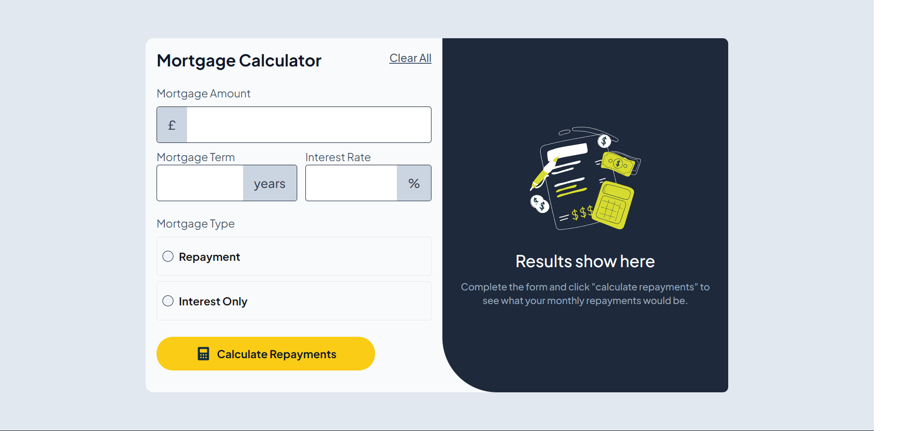
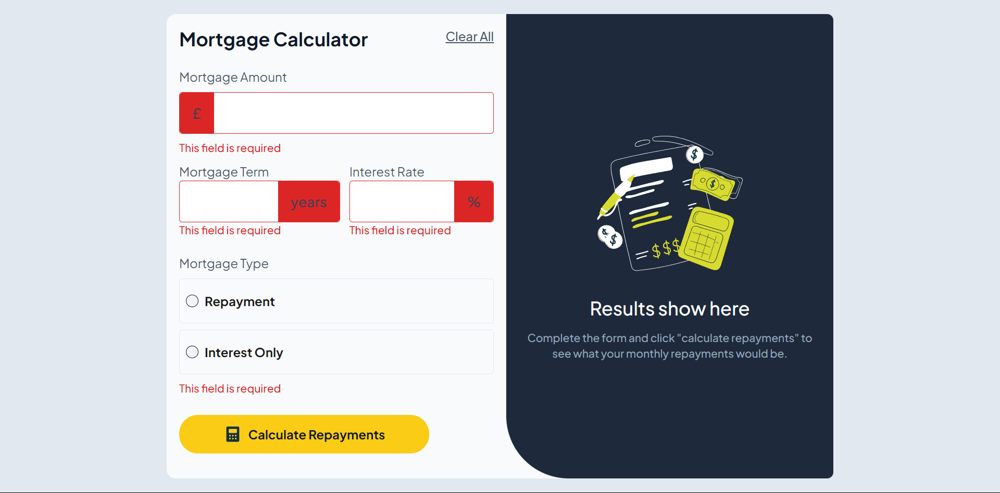

# Frontend Mentor - Mortgage repayment calculator solution

This is a solution to the [Mortgage repayment calculator challenge on Frontend Mentor](https://www.frontendmentor.io/challenges/mortgage-repayment-calculator-Galx1LXK73).

## Table of contents

- [Overview](#overview)
  - [The challenge](#the-challenge)
  - [Screenshot](#screenshot)
  - [Links](#links)
- [My process](#my-process)
  - [Built with](#built-with)
  - [What I learned](#what-i-learned)
  - [Continued development](#continued-development)
  - [Useful resources](#useful-resources)
- [Author](#author)
- [Acknowledgments](#acknowledgments)

## Overview

### The challenge

The primary objectives of the challenge include:

- Allowing users to input mortgage details and receive both monthly repayment and total repayment amounts upon form submission.
- Providing form validation messages if any required fields are left incomplete.
- Ensuring the form is fully operable via keyboard navigation.
- Creating a responsive layout that adapts seamlessly to various screen sizes.
- Implementing hover and focus states for all interactive elements to enhance user experience.

### Screenshot

 (2).png>)

### Links

- Solution URL: [Add solution URL here](https://your-solution-url.com)
- Live Site URL: [Add live site URL here](https://your-live-site-url.com)

## My process

### Built with

- [React](https://reactjs.org/) - JS library
- Tailwind CSS - Utility-first CSS Framework
- Flexbox 
- Mobile-first workflow

### What I learned
 
During this project, I focused on effectively utilizing the useRef hook for managing form inputs and minimizing state updates by combining useRef with useState hooks. This approach improved form handling and reduced unnecessary re-renders, leading to more efficient code
 
### Continued development

Moving forward, I aim to:

Optimize the codebase by reducing lines of code while enhancing functionality.
Focus on writing cleaner, more readable code.
Explore advanced state management techniques and refactoring patterns.

### Useful resources

- [React Documentation](https://react.dev/) - An invaluable resource for understanding and implementing useRef in form handling.
- [Tailwind Documentation](https://tailwindcss.com/) - Provided guidance on utility class usage for styling.

## Author
- Frontend Mentor - [@benazeem](https://www.frontendmentor.io/profile/benazeem)

## Acknowledgments 

Special thanks to the Frontend Mentor community for their continuous support and feedback.

